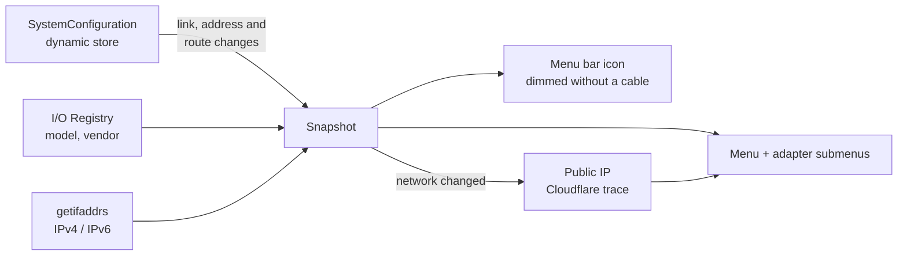

# Freewire

A macOS menu bar app that shows the state of your wired Ethernet connection: whether a cable is connected, whether
it carries your traffic, your public IP address and the details of every adapter. Useful on macOS versions that have
no Ethernet item of their own in the menu bar.

## How It Works



- **Ethernet: Connected** when any wired adapter has a link; the icon is dimmed when none does.
- **Active: Yes** (green dot) when a wired adapter is the primary interface, so traffic goes through the cable and
  not through Wi-Fi.
- **Public IP Address**, looked up at `https://www.cloudflare.com/cdn-cgi/trace` a couple of seconds after each
  network change and when the menu opens after 5 minutes. It can be turned off in Settings.
- **Interfaces**: one submenu per adapter (USB, Thunderbolt dock, built-in) with device, model, vendor, MAC
  address, name, IPv4 and IPv6 addresses and link status. Idle Thunderbolt ports are hidden; adapters without a cable
  can be hidden too.
- Optional notifications when Ethernet connects or disconnects, and **Open at Login** from the menu.
- Updates are event driven (no polling): the app listens to the same dynamic store keys System Settings uses.

## Stack

| Layer | Technology |
|-------|------------|
| App | Swift 6, AppKit `NSStatusItem` + `NSMenu`, SwiftUI settings, `SMAppService` (open at login) |
| Core | Swift package `FreewireCore`: interface reader, dynamic store monitor, public IP lookup |
| macOS APIs | SystemConfiguration, IOKit, getifaddrs, UserNotifications |
| Tests | Swift Testing (`swift test`), CI on macOS |
| Project | XcodeGen (`project.yml`) |
| Distribution | Developer ID signed, hardened runtime, notarized and stapled zip on GitHub Releases |

## Install

Requires macOS 14 or later.

1. Download `Freewire-<version>.zip` from [Releases](../../releases), unzip it and move **Freewire.app** to
   **Applications**.
2. Open it; the `<···>` icon appears in the menu bar.
3. Optional: menu › **Open at Login**, and **Settings…** for the public IP lookup, idle adapters and notifications.

To update, quit Freewire and replace the app. Logs:
`/usr/bin/log show --last 1h --predicate 'subsystem == "io.github.sergioarojasm98.freewire"'`.

## Build

```bash
swift test --package-path FreewireCore     # core tests
xcodegen generate && open Freewire.xcodeproj
```

Debug builds use their own bundle id (`…freewire.debug`); `--args -previewMenu`, `-previewDetails en0` or
`-previewSettings` open the menu, an adapter submenu or the settings at launch.

`scripts/release.sh vX.Y.Z` builds on a Mac over SSH, runs the tests, signs inside a temporary keychain with secrets
read from 1Password, notarizes, staples, checks Gatekeeper and publishes the zip and its SHA-256 as a GitHub release.
The tag must match `MARKETING_VERSION` in `project.yml`.

## License

[MIT](LICENSE)
